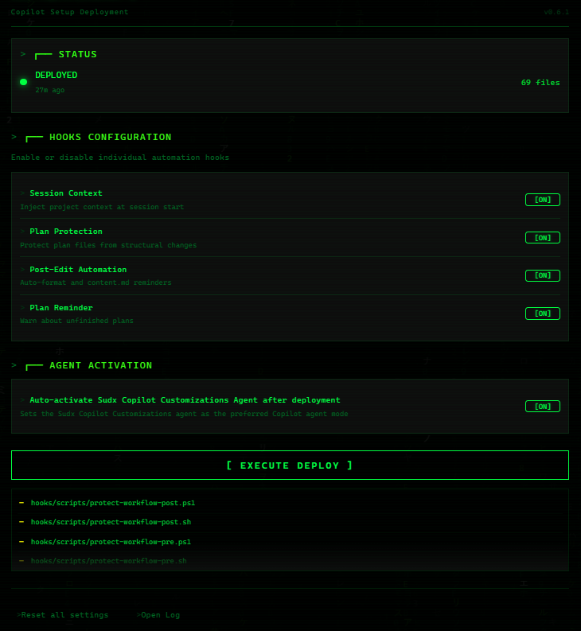
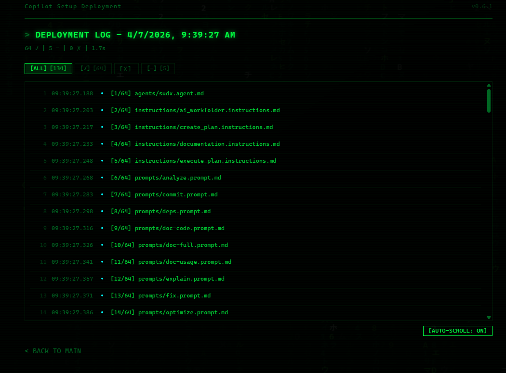

<div align="center">

# 🖥️ Sudx Copilot Customizations

[](https://code.visualstudio.com/)
[](https://www.typescriptlang.org/)
[](plugin/LICENSE)
[](https://github.com/features/copilot)

**Deploy pre-configured AI Agent Customization Files for GitHub Copilot**

*Agent Definitions · Skills · Prompts · Instructions · Hooks*

</div>

---

## 📑 Table of Contents

### User Documentation
- [Overview](#overview)
- [Quick Start](#-quick-start)
- [Commands](#-commands)
- [Deployed Content](#-deployed-content)
- [Hooks](#-hooks)
- [Main View](#-main-view)
  - [Status Display](#status-display)
  - [Hook Controls](#hook-controls)
  - [Agent Toggle](#agent-toggle)
  - [Deploy Button](#deploy-button)
- [Log View](#-log-view)
- [Settings](#%EF%B8%8F-settings)
- [Accessibility](#-accessibility)
- [Error Handling](#-error-handling)
- [Performance](#-performance)
- [Security](#-security)
- [Requirements](#-requirements)
- [Build](#-build)

### Technical Documentation
- [Architecture Overview](#-architecture-overview)
- [CSS Stack](#css-stack)
- [JS Stack](#js-stack-load-order)
- [TypeScript Backend](#typescript-backend)
- [Design System](#-design-system)
- [Provider HTML Generation](#-providerts--html-generation)
- [Messaging & RateLimiter](#-messagingts--ratelimiter)
- [Settings OldValue Tracking](#-settingsts--oldvalue-tracking)
- [StatusBar](#-statusbarts--progress--deploy-info)
- [Bug Fixes v0.3.2](#-bug-fixes-v032)

---

# User Documentation

---

## Overview

The Sudx Copilot Customizations Extension provides a terminal-hacker interface as a VS Code Webview. It displays deployment status, controls hooks and agent settings, and offers a comprehensive log system.

---

## 🚀 Quick Start

> **3 steps to your first deploy:**

<kbd>Ctrl</kbd> + <kbd>Shift</kbd> + <kbd>P</kbd> → `Sudx CC: Open Setup Panel` → **[ EXECUTE DEPLOY ]**

> [!TIP]
> Alternative: Click on **Sudx CC** in the statusbar (bottom right)

---

## 📋 Commands

| Command | Description |
|:--------|:------------|
| `Sudx CC: Open Setup Panel` | Opens the configuration panel |
| `Sudx CC: Deploy Configuration` | Start deployment directly |
| `Sudx CC: Reset Configuration` | Reset all settings |
| `Sudx CC: Show Log` | Show deployment log |

---

## 📦 Deployed Content

| Category | Count | Description |
|:---------|:-----:|:------------|
| **Agent** | 1 | Sudx Agent definition |
| **Instructions** | 4 | Planning rules, docs standards, AI workspace, plan execution |
| **Prompts** | 21 | Analysis, commit, debug, docs, features, optimization, review, tests |
| **Skills** | 12 | Plan skills (full/selective) + documentation skills |
| **Hooks** | 12 | 4 configs + 8 scripts (PS1 & SH) |

---

## 🔗 Hooks

| Hook | Event | Function |
|:-----|:------|:---------|
| **Session Context** | `SessionStart` | Injects project context at Copilot session start |
| **Plan Protection** | `PostToolUse` | Protects plan files from accidental structural changes |
| **Post-Edit** | `PostToolUse` | Reminds about `content.md` updates after file edits |
| **Plan Reminder** | `UserPromptSubmit` | Warns about open, unfinished plans in workspace |

---

## 🖥️ Main View

<div align="center">
  
</div>

### Status Display

A blinking dot indicates the current status:

| Color | Meaning |
|:------|:--------|
| 🟢 Green pulsing | Deployed and active |
| ⚪ Gray | Not deployed |
| 🟡 Yellow fast pulsing | Deploy in progress |
| 🔴 Red | Error occurred |

Additionally displays the number of deployed files and last deploy date.

### Hook Controls

Four hooks can be individually enabled or disabled:

- **Session Context** — Context information for the current session
- **Protect Plans** — Protection of plan files
- **Post Edit** — Post-processing after changes
- **Plan Reminder** — Reminders for open plans

Each hook has a toggle switch. Click or press <kbd>Space</kbd>/<kbd>Enter</kbd> to toggle.

### Agent Toggle

Enables or disables automatic agent activation.

### Deploy Button

Starts the deploy process. During deployment, a progress bar is displayed. Upon completion, a summary shows the results: Deployed, Skipped, Errors, and Duration.

---

## 📜 Log View

<div align="center">
  
</div>

Accessible via the Log button in the footer. Displays all deploy entries chronologically.

### Filter

Entries can be filtered by type: **All**, **Success**, **Error**, **Skipped**. The count of each type is shown as a badge.

### Export

The Export button saves the complete log as a file.

### Navigation

The Back button returns to the main view. Page transitions use smooth crossfade animations.

---

## ⚙️ Settings

### General Settings

| Setting | Default | Description |
|:--------|:-------:|:------------|
| `sudx-ai.deployPath` | `.github` | Target directory for deployment |
| `sudx-ai.autoActivateAgent` | `true` | Activate agent after deploy |
| `sudx-ai.hooks.*` | All active | Control individual hooks |
| `sudx-ai.showStatusBar` | `true` | Show statusbar button |
| `sudx-ai.logLevel` | `info` | Log level: `debug`, `info`, `warn`, `error` |

### UI Settings

Under **"Sudx CC — UI & Appearance"** in VS Code Settings:

| Setting | Default | Description |
|:--------|:-------:|:------------|
| `sudx-ai.ui.matrixRain` | `true` | Animated matrix rain background |
| `sudx-ai.ui.crtOverlay` | `true` | Retro CRT scanline effect |
| `sudx-ai.ui.animations` | `true` | All UI animations |

> [!NOTE]
> Changes are applied immediately in the webview.

---

## ♿ Accessibility

- All interactive elements are keyboard accessible
- Screen readers receive status announcements on changes
- When **"Reduce Motion"** is enabled in the OS, all animations are stopped
- High contrast mode removes glows and shadows
- Keyboard navigation: <kbd>Tab</kbd> through all elements, <kbd>Enter</kbd>/<kbd>Space</kbd> to activate

---

## ⚠️ Error Handling

### Connection Errors

When connection to the extension is lost, an **error banner** appears with a Retry button. The system automatically attempts reconnection up to **3 times** with increasing delays.

### Deploy Errors

Errors during deployment are displayed in the log. Status changes to red. After a configurable time, the display automatically resets.

---

## ⚡ Performance

- Matrix Rain and CRT effects are automatically **paused** when the tab is not visible
- With many log entries, the DOM is limited to a maximum of **500 entries**
- Canvas animations automatically adapt to available frame rate

---

## 🔒 Security

> [!IMPORTANT]
> The extension automatically protects critical directories.

| Protection | Details |
|:-----------|:--------|
| **Automatic Backups** | max. 5 per file |
| **Blocked Paths** | `.git`, `node_modules`, `.vscode`, `src`, `dist`, `build`, `out` |
| **File Size Limit** | max. 1 MB per file |
| **Total Limit** | max. 50 MB |
| **File Count** | max. 200 files |
| **Retry Attempts** | 3 for file operations |

---

## 📋 Requirements

- [x] VS Code **1.85.0** or newer
- [x] GitHub Copilot Chat Extension (for agent activation)

---

## 🔨 Build

```bash
cd plugin
npm install
npm run package
```

**Output:** `plugin/sudx-copilot-customizations-X.X.X.vsix`

<details>
<summary><strong>📦 VSIX Installation</strong></summary>

<kbd>Ctrl</kbd> + <kbd>Shift</kbd> + <kbd>P</kbd> → `Extensions: Install from VSIX...` → Select VSIX

</details>

---

# Technical Documentation

---

## 🏗️ Architecture Overview

The Webview UI consists of **3 CSS files** and **5 JS files**, assembled via `provider.ts` as an HTML template and rendered in a VS Code WebviewPanel.

### CSS Stack

| File | Purpose |
|:-----|:--------|
| `media/styles/main.css` | Design system foundation: CSS custom properties, base resets, CRT overlay, responsive breakpoints, scrollbar, focus/selection, theme layers |
| `media/styles/animations.css` | All animations: fadeSlideUp, fadeSlideLeft, shake, pulse, skeleton shimmer, matrix-rain glow, progress pulse |
| `media/styles/components.css` | BEM components: sections, toggles, hook-items, status-dot, log-viewer, deploy-button, tooltips, error-banner |

### JS Stack (Load Order)

| File | Purpose | Global Object |
|:-----|:--------|:--------------|
| `media/scripts/messaging.js` | VS Code API communication, heartbeat, rate-limiting | `window.SudxMessaging` |
| `media/scripts/animations.js` | Matrix Rain, countUp, stagger, particles, destroyAll | `window.SudxAnimations` |
| `media/scripts/terminalLogo.js` | Terminal logo typing animation with tooltip | `window.SudxTerminalLogo` |
| `media/scripts/deploy.js` | Deploy UI: log viewer, progress, auto-reset, export | `window.SudxDeploy` |
| `media/scripts/main.js` | Boot sequence, page nav, status, config sync, feature flags | IIFE (no export) |

### TypeScript Backend

| File | Purpose |
|:-----|:--------|
| `src/webview/provider.ts` | WebviewViewProvider — HTML generation (modularized in sub-methods), message routing, nonce caching, UI settings push |
| `src/webview/messaging.ts` | Server-side message validation, sliding-window RateLimiter, handler duration logging |
| `src/constants.ts` | Central constants: STRINGS, UI_CONSTANTS, FEATURES, ERROR_STRINGS, ANIMATION_TIMINGS, LOG_CONSTANTS, DEBUG_STRINGS |
| `src/types.ts` | All TypeScript interfaces: ILogEntry, IRateLimiterConfig, IConnectionHealth, IDeploySummary, IAnimationConfig, IThemeConfig, ILogFilterState, discriminated message unions |
| `src/config/settings.ts` | Settings manager: OldValue tracking, batch UI read, validateSettings, export/import |
| `src/statusBar.ts` | Status bar item: Configurable reset timer, progress display, deploy-info tooltip |

---

## 🎨 Design System

### CSS Custom Properties

**Colors:**
| Variable | Value |
|:---------|:------|
| `--green-primary` | `#00ff41` |
| `--green-dark` | `#006622` |
| `--bg-primary` | `#000` |
| `--bg-secondary` | `#0d0d0d` |
| `--red-primary` | `#ff0033` |
| `--yellow-accent` | `#ffff00` |

**State Colors:** `--state-success`, `--state-error`, `--state-warning`, `--state-info`, `--state-deploying`

**Timing Tokens:**
| Variable | Value |
|:---------|:------|
| `--cursor-blink-rate` | `0.8s` |
| `--timing-pulse-active` | `2s` |
| `--timing-pulse-deploy` | `1s` |
| `--timing-pulse-error` | `1.5s` |

**Typography:** Fluid `clamp()`-based, 6 levels (`--font-size-xs` to `--font-size-xxl`), JetBrains Mono / Fira Code / monospace

**Container:** `--container-max-width: clamp(320px, 90vw, 840px)`

**Theme Layer:** `:root[data-theme="dark"]` active, `:root[data-theme="light"]` skeleton prepared

### Responsive Breakpoints

| Breakpoint | Adjustments |
|:-----------|:------------|
| `768px` | Tablet: reduced spacings, glow reduction |
| `520px` | Mobile: compact spacings, smaller fonts |
| `320px` | Small mobile: minimum sizes |

### Accessibility Media Queries

| Media Query | Adjustment |
|:------------|:-----------|
| `prefers-contrast: more` | Glows off, borders enhanced, text-shadow removed |
| `prefers-reduced-motion: reduce` | All animations stopped, CRT scanlines off |
| `forced-colors: active` | Canvas/CanvasText system colors, Matrix/CRT hidden |

**WCAG Contrast:** `#00ff41` on `#000` = **15.38:1** (AAA)

**ARIA Features:** Skip navigation link, `role="progressbar"`, `aria-roledescription="toggle switch"`, `role="tooltip"`

---

## 📄 provider.ts — HTML Generation

### Modularized Sub-Methods

| Method | Returns |
|:-------|:--------|
| `resolveMediaUris()` | `{ styles, scripts }` — vscode-webview URIs |
| `getFeatureFlags()` | `IFeatureFlags` from settings |
| `buildMatrixCanvas()` | `<canvas id="matrix-canvas">` |
| `buildErrorBanner()` | Skip nav link + error banner (hidden) |
| `buildLogoSection()` | Terminal logo with typing animation |
| `buildStatusSection()` | Status dot, file count, deploy date |
| `buildHooksSection()` | Hook toggles with `aria-checked`, `title` |
| `buildAgentSection()` | Agent toggle |
| `buildDeploySection()` | Deploy button with progressbar + `aria-*` |
| `buildFooter()` | Reset/Log buttons |
| `buildLogPage()` | Log viewer with filter, export, back |
| `buildScripts()` | `<script defer data-load-order="N">` tags |

### Nonce Caching

`getOrCreateNonce()` generates a nonce per panel instance and caches it in `_panelNonce`. Reset on `dispose()`.

### Message Routing

| Handler | Function |
|:--------|:---------|
| `pushUiSettings` | Webview → Extension: Request UI settings |
| `getLogData` | Request log data |

Settings change listener automatically pushes UI settings on extension-side changes.

---

## 📨 messaging.ts — RateLimiter

### Sliding Window Algorithm

```typescript
class RateLimiter {
  private timestamps: number[] = [];
  private rules: Map<string, { limit: number; windowMs: number }>;

  check(type?: string): { allowed: boolean; retryAfterMs?: number }
  addRule(type: string, config: { limit: number; windowMs: number }): void
}
```

| Rule | Limit |
|:-----|:------|
| Global | 30 messages / 1000ms |
| Deploy | 1 deploy / 5000ms |

Old timestamps are cleaned up on each check.

### Validation

`validatePayload()` returns `string | null` (specific error message instead of boolean). Hook validation checks against known hook list and provides suggestions.

---

## ⚙️ settings.ts — OldValue Tracking

`_cachedValues: Map<string, unknown>` stores all setting values on initialization. On `notifyChangeHandlers()`, `{ key, oldValue, newValue }` is sent. Batch read for UI settings via `config.get<Record>('ui')`.

### Methods

| Method | Function |
|:-------|:---------|
| `validateSettings()` | Validate settings |
| `migrateSettings()` | Migrate settings |
| `exportSettings()` | Export settings |
| `importSettings()` | Import settings |

---

## 📊 statusBar.ts — Progress & Deploy Info

| Method | Function |
|:-------|:---------|
| `setProgress(percent)` | Shows `$(sync~spin) Sudx CC: 45%` |
| `setDeployInfo(fileCount, lastDeploy)` | Enriches tooltip with details |

Configurable reset via `UI_CONSTANTS.STATUS_BAR_RESET_MS`.

---

## 🐛 Bug Fixes v0.3.2

| File | Change |
|:-----|:-------|
| `src/utils/logger.ts` | Singleton re-entrancy guard (`isCreating` flag), `safeStringify()` with WeakSet circular reference detection |
| `src/utils/paths.ts` | `isInsideWorkspace()` uses `fs.realpathSync()` for symlink-aware path traversal check |
| `src/utils/fileOps.ts` | `walkDirectory()` with `visitedPaths` Set and `MAX_RECURSION_DEPTH=20` for symlink loop protection |
| `src/deployment/engine.ts` | Promise-based deploy lock (`deployPromise`), `DEPLOY_TIMEOUT_MS=120s` with Promise.race |
| `src/webview/provider.ts` | `escapeHtml()` with null-check and backtick escaping |
| `src/config/state.ts` | History truncation logging, migration with documented fire-and-forget |

---

## 📁 Project Structure

```text
plugin/                      # VS Code Extension Source
├── src/                     # TypeScript Backend
│   ├── commands.ts          # Command handlers
│   ├── constants.ts         # Central constants
│   ├── extension.ts         # Extension entry point
│   ├── statusBar.ts         # StatusBar integration
│   ├── types.ts             # TypeScript interfaces
│   ├── config/
│   │   ├── settings.ts      # Settings manager
│   │   └── state.ts         # State persistence
│   ├── deployment/
│   │   ├── agent.ts         # Agent activation
│   │   ├── copier.ts        # File copy logic
│   │   ├── engine.ts        # Deploy engine
│   │   ├── hooks.ts         # Hook management
│   │   └── scanner.ts       # Template scanner
│   ├── utils/
│   │   ├── fileOps.ts       # File operations
│   │   ├── logger.ts        # Logging system
│   │   └── paths.ts         # Path utilities
│   └── webview/
│       ├── messaging.ts     # Message handling
│       └── provider.ts      # WebviewViewProvider
├── media/                   # Webview UI
│   ├── styles/
│   │   ├── main.css         # Design system
│   │   ├── animations.css   # Animations
│   │   └── components.css   # BEM components
│   └── scripts/
│       ├── messaging.js     # VS Code API
│       ├── animations.js    # Matrix Rain, particles
│       ├── terminalLogo.js  # Logo animation
│       ├── deploy.js        # Deploy UI
│       └── main.js          # Boot, navigation
└── templates/               # Files to deploy
    ├── agents/              # Agent definition
    ├── hooks/               # Hook configs + scripts
    ├── instructions/        # Planning rules
    ├── prompts/             # Copilot prompts
    └── skills/              # Plan & docs skills

docs/                        # Documentation
├── code_docs/               # Technical documentation
└── usage_docs/              # User documentation

build.py                     # Build script
```

---

<div align="center">

## 📄 License

**MIT** — see [LICENSE](plugin/LICENSE)

---

*Made with 💚 for the Copilot Community*

</div>
